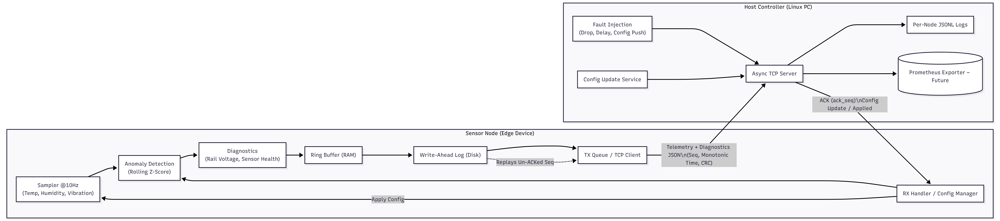

# Design Overview

## Goals
Provide a small, reliable system for distributed telemetry with anomaly detection, diagnostics, runtime configuration, outage tolerance with replay, bounded memory, and safe start/stop. 

Keep mechanisms simple, testable and observable.

## System Architecture

The system follows a two-tier model:
1. **Edge Nodes** that collect sensor data and run diagnostics.
2. **A Host Controller** that aggregates, logs, and commands those nodes.

Communication is event-driven over TCP, with acknowledgments (`ACK`) ensuring delivery reliability and configuration updates (`config_update`) allowing runtime reconfiguration without restarting the system.

## Dataflow
Sensors -> Node Sampler -> Anomaly/Diag -> Ring+WAL -> TCP -> Host -> Log, ACK -> Node compact WAL

## Subsystems
### Host
- **TCP Server:** Manages simultaneous node connections, receives telemetry JSON messages, and sends acknowledgments.
- **Configuration Broadcast:** Periodically issues configuration updates (e.g., anomaly thresholds) to demonstrate dynamic control.
- **Fault Injection:** Randomly drops or delays messages to simulate network outages and validate replay behavior.
- **Persistent Logging:** Writes per-node JSONL log files for analysis and debugging.

### Node
- **Sampler (10 Hz):** Generates or reads environmental data (temperature, humidity, vibration).  
- **Anomaly Detection:** Computes rolling z-scores (Welford’s algorithm) to detect deviations beyond configurable thresholds.  
- **Diagnostics:** Performs simulated health checks (e.g., power rail validation) to flag degraded conditions.  
- **Ring Buffer + WAL:** Maintains a bounded in-memory buffer for quick access and an on-disk WAL for persistence during outages.  
- **TX/RX Manager:** Sends telemetry, awaits host acknowledgments, replays unacknowledged data after reconnects, and applies configuration updates atomically.

## Key Decisions & Trade-offs
- **Protocol:** Chose newline-delimited JSON for human readability and fast prototyping. Although verbose, it allows simple incremental streaming and debugging via command-line tools.  
- **Durability:** WAL ensures no data loss even if power is interrupted mid-transfer. WAL compaction after ACK bounds disk usage.  
- **Ordering & Integrity:** Every message has a unique sequence number and both monotonic and wall-clock timestamps.  
- **Anomaly Detection:** Lightweight and O(1) per update. Rolling mean/stddev lets the node adapt to changing baselines.  
- **Backpressure:** When the ring buffer fills beyond 80%, the node marks itself as `degraded` and prioritizes transmissions over new samples.  
- **Runtime Config:** Configuration updates include a version number and are applied atomically to maintain deterministic behavior.

## Timing & Data Integrity
- **Sequential Ordering:** Sequence numbers strictly increase per node.  
- **Monotonic Time:** Used for ordering even when system clocks shift.  
- **Integrity Checks:** Each message is validated on host receipt; corrupted frames are ignored gracefully.

## Outage Tolerance / Replay
- **Offline Sampling:** When disconnected, the node continues collecting samples.  
- **Reconnection Replay:** Upon reconnect, the node retransmits all records beyond the last acknowledged sequence number.  
- **WAL Compaction:** Keeps storage bounded by trimming confirmed entries.

## Diagnostics
Diagnostics are reported per sample and include simple but structured results (e.g., `rail_low`, `sensor_unresponsive`).  
This makes logs actionable for both automated monitoring and operator review.

## Safe Startup & Shutdown
At startup, the node replays any existing WAL records before resuming normal sampling.  
Sampling and transmission run as independent asynchronous tasks, ensuring that restarts and reconnects do not block each other.  
A graceful shutdown ensures that pending WAL writes are flushed and acknowledged messages are retained for the next session.

## Potential Security & Firmware Updates
These are **design-level enhancements** for real embedded deployment:
- **A/B Partitions + Atomic Switch:** Firmware is downloaded to an inactive partition. After signature verification and health checks, the bootloader switches partitions atomically.  
- **Signed Images & Secure Boot:** Only signed, verified firmware is executed.  
- **Anti-Rollback Protection:** Firmware versions are monotonic; older versions are rejected to prevent downgrades.  
- **Watchdog Health Check & Rollback:** Post-boot watchdog verifies successful startup; failures trigger automatic rollback to the previous version.  
- **Transport Security:** All host–node traffic can be protected using TLS or mTLS with certificate pinning for mutual authentication.

## Potential Future Extensions
- **Binary Framing + TLS/mTLS:** Migrate from text to length-prefixed binary frames over encrypted channels for efficiency and security.  
- **Prometheus Exporter / Grafana Dashboard:** Add runtime metrics on the host to visualize node status, replay backlog, and anomaly counts.  
- **On-node Health Indicators:** Implement LED or web dashboard for local status visualization.  
- **Automated Testing & CI/CD:** Add unit tests (pytest) for ring buffer and WAL logic, plus GitHub Actions integration for continuous verification.